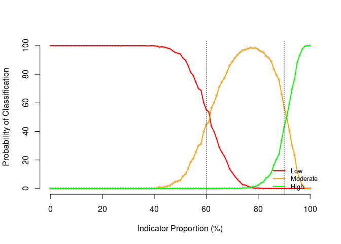

# sleacr: Simplified Lot Quality Assurance Sampling Evaluation of Access and Coverage (SLEAC) Tools

In the recent past, measurement of coverage has been mainly through
two-stage cluster sampled surveys either as part of a nutrition
assessment or through a specific coverage survey known as Centric
Systematic Area Sampling (CSAS). However, such methods are resource
intensive and often only used for final programme evaluation meaning
results arrive too late for programme adaptation. SLEAC, which stands
for Simplified Lot Quality Assurance Sampling Evaluation of Access and
Coverage, is a low resource method designed specifically to address this
limitation and is used regularly for monitoring, planning and
importantly, timely improvement to programme quality, both for agency
and Ministry of Health (MoH) led programmes. This package provides
functions for use in conducting a SLEAC assessment.

## What does the package do?

The [sleacr](https://nutriverse.io/sleacr/) package provides functions
that facilitate the design, sampling, data collection, and data analysis
of a SLEAC survey. The current version of the
[sleacr](https://nutriverse.io/sleacr/) package currently provides the
following:

- Functions to calculate the sample size needed for a SLEAC survey;

- Functions to draw a stage 1 sample for a SLEAC survey;

- Functions to classify coverage;

- Functions to determine the performance of chosen classifier cut-offs
  for analysis of SLEAC survey data;

- Functions to estimate coverage over wide areas; and,

- Functions to test for coverage homogeneity across multiple surveys
  over wide areas.

## Installation

You can install [sleacr](https://nutriverse.io/sleacr/) from
[CRAN](https://cran.r-project.org) with:

``` r
install.packages("sleacr")
```

## Usage

### Lot quality assurance sampling frame

To setup an LQAS sampling frame, a target sample size is first
estimated. For example, if the survey area has an estimated population
of about 600 severe acute malnourished (SAM) children and you want to
assess whether coverage is reaching at least 50%, the sample size can be
calculated as follows:

``` r
get_sample_n(N = 600, dLower = 0.5, dUpper = 0.8)
```

which gives an LQAS sampling plan list with values for the target
minimum sample size (`n`), the decision rule (`d`), the observed alpha
error (`alpha`), and the observed beta error (`beta`).

``` R
#> $n
#> [1] 19
#> 
#> $d
#> [1] 12
#> 
#> $alpha
#> [1] 0.06446194
#> 
#> $beta
#> [1] 0.08014249
```

In this sampling plan, a target minimum sample size of 19 SAM cases
should be aimed for with a decision rule of more than 12 SAM cases
covered to determine whether programme coverage is at least 50% with
alpha and beta errors no more than 10%. The alpha and beta errors
requirement is set at no more than 10% by default. This can be made more
precise by setting alpha and beta errors less than 10%.

There are contexts where survey data has already been collected and the
sample is less than what was aimed for based on the original sampling
frame. The
[`get_sample_d()`](https://nutriverse.io/sleacr/reference/get_sample.md)
function is used to determine the error levels of the achieved sample
size. For example, if the survey described above only achieved a sample
size of 16, the
[`get_sample_d()`](https://nutriverse.io/sleacr/reference/get_sample.md)
function can be used as follows:

``` r
get_sample_d(N = 600, n = 16, dLower = 0.5, dUpper = 0.8)
```

which gives an alternative LQAS sampling plan based on the achieved
sample size.

``` R
#> $n
#> [1] 16
#> 
#> $d
#> [1] 10
#> 
#> $alpha
#> [1] 0.07890285
#> 
#> $beta
#> [1] 0.1019738
```

In this updated sampling plan, the decision rule is now more than 10 SAM
cases but with higher alpha and beta errors. Note that the beta error is
now slightly higher than 10%.

### Stage 1 sample

The first stage sample of a SLEAC survey is a systematic spatial sample.
Two methods can be used and both methods take the sample from all parts
of the survey area: the *list-based* method and the *map-based* method.
The [sleacr](https://nutriverse.io/sleacr/) package currently supports
the implementation of the *list-based* method.

In the list-based method, communities to be sampled are selected
systematically from a complete list of communities in the survey area.
This list of communities should sorted by one or more non-overlapping
spatial factors such as district and subdistricts within districts. The
`village_list` dataset is an example of such a list.

``` r
village_list
#> # A tibble: 1,001 × 4
#>       id chiefdom section village  
#>    <dbl> <chr>    <chr>   <chr>    
#>  1     1 Badjia   Damia   Ngelehun 
#>  2     2 Badjia   Damia   Gondama  
#>  3     3 Badjia   Damia   Penjama  
#>  4     4 Badjia   Damia   Jawe     
#>  5     5 Badjia   Damia   Dambala  
#>  6     6 Badjia   Fallay  Bumpewo  
#>  7     7 Badjia   Fallay  Pelewahun
#>  8     8 Badjia   Fallay  Pendembu 
#>  9     9 Badjia   Kpallay Jokibu   
#> 10    10 Badjia   Kpallay Kpaku    
#> # ℹ 991 more rows
```

The
[`get_sampling_list()`](https://nutriverse.io/sleacr/reference/get_sampling.md)
function implements the list-based sampling method. For example, if 40
clusters/villages are needed to be sampled to find the 19 SAM cases
calculated earlier, a sampling list can be created as follows:

``` r
get_sampling_list(village_list, 40)
```

which provides the following sampling list:

|  id | chiefdom      | section       | village          |
|----:|:--------------|:--------------|:-----------------|
|  20 | Badjia        | Njargbahun    | Kpetema          |
|  45 | Bagbe         | Jongo         | Yengema          |
|  70 | Bagbe         | Samawa        | Baiama           |
|  95 | Bagbo         | Jimmi         | Kpawama          |
| 120 | Bagbo         | Mano          | Dandabu          |
| 145 | Baoma         | Bambawo       | Kenemawo         |
| 170 | Baoma         | Fallay        | Gbandi           |
| 195 | Baoma         | Mawojeh       | Ngelahun         |
| 220 | Baoma         | Upper Pataloo | Yakaji           |
| 245 | Bumpe Ngao    | Bumpe         | Waiima           |
| 270 | Bumpe Ngao    | Foya          | Bobobu           |
| 295 | Bumpe Ngao    | Bongo         | Belebu           |
| 320 | Bumpe Ngao    | Serabu        | Nyahagoihun      |
| 345 | Bumpe Ngao    | Taninahun     | Kpetewoma        |
| 370 | Bumpe Ngao    | Taninahun     | Mokebi           |
| 395 | Bumpe Ngao    | Taninahun     | Ngiegboiya       |
| 420 | Gbo           | Gbo           | Kotumahun Mavi   |
| 445 | Gbo           | Nyawa         | Foya             |
| 470 | Jaiama Bongor | Lower Niawa   | Baraka           |
| 495 | Jaiama Bongor | Tongowa       | Talia            |
| 520 | Jaiama Bongor | Upper Niawa   | Nyeyama          |
| 545 | Kakua         | Kpandobu      | Fabaina          |
| 570 | Kakua         | Nyallay       | Jandama          |
| 595 | Kakua         | Sewa          | Kenedeyama       |
| 620 | Komboya       | Kemoh         | Gumahun          |
| 645 | Komboya       | Mangaru       | Sengbehun        |
| 670 | Lugbu         | Kargbevu      | Momandu          |
| 695 | Niawa Lenga   | Lower Niawa   | Luawa            |
| 720 | Niawa Lenga   | Yalenga       | Dandabu          |
| 745 | Selenga       | Mokpendeh     | Jolu             |
| 770 | Tikonko       | Ngolamajie    | Baoma (Geyewoma) |
| 795 | Tikonko       | Seiwa         | Gendema          |
| 820 | Tikonko       | Seiwa         | Towama           |
| 845 | Tikonko       | Seiwa         | Kpawugbahun      |
| 870 | Valunia       | Deilenga      | Hendogboma       |
| 895 | Valunia       | Lower Kargoi  | Gombu            |
| 920 | Valunia       | Lunia         | Kpetema          |
| 945 | Valunia       | Manyeh        | Malema           |
| 970 | Valunia       | Yarlenga      | Dassamu          |
| 995 | Wonde         | Manyeh        | Kigbema          |

### Classifying coverage

With data collected from a SLEAC survey, the `lqas_classify_coverage()`
function is used to classify coverage. The
[sleacr](https://nutriverse.io/sleacr/) package comes with the
`survey_data` dataset from a national SLEAC survey conducted in Sierra
Leone.

``` r
survey_data
#> # A tibble: 14 × 7
#>    country      province     district      cases_in cases_out rec_in cases_total
#>    <chr>        <chr>        <chr>            <int>     <int>  <int>       <int>
#>  1 Sierra Leone Northern     Bombali              4        26      6          30
#>  2 Sierra Leone Northern     Koinadugu            0        32      6          32
#>  3 Sierra Leone Northern     Kambia               0        28      0          28
#>  4 Sierra Leone Northern     Port Loko            2        28      0          30
#>  5 Sierra Leone Northern     Tonkolili            1        27      5          28
#>  6 Sierra Leone Eastern      Kono                 2        14      3          16
#>  7 Sierra Leone Eastern      Kailahun             4        30      3          34
#>  8 Sierra Leone Eastern      Kenema               8        26      4          34
#>  9 Sierra Leone Southern     Pujehun              6        21      1          27
#> 10 Sierra Leone Southern     Bo                   6        16      8          22
#> 11 Sierra Leone Southern     Bonthe               7        34      2          41
#> 12 Sierra Leone Southern     Moyamba              6        34      0          40
#> 13 Sierra Leone Western Area Western Area…        6        40      5          46
#> 14 Sierra Leone Western Area Western Area…        2        18      0          20
```

Using this dataset, per district coverage classifications can be
calculated as follows:

``` r
with(
  survey_data, 
  lqas_classify(
    cases_in = cases_in, cases_out = cases_out, rec_in = rec_in
  )
)
```

which outputs the following results:

``` R
#>    cf tc
#> 1   0  1
#> 2   0  0
#> 3   0  0
#> 4   0  0
#> 5   0  0
#> 6   0  1
#> 7   0  0
#> 8   1  1
#> 9   1  1
#> 10  1  1
#> 11  0  0
#> 12  0  0
#> 13  0  0
#> 14  0  0
```

The function provides estimates for *case-finding effectiveness* and for
*treatment coverage* as a `data.frame` object.

### Assessing classifier performance

It is useful to be able to assess the performance of the classifier
chosen for a SLEAC survey. For example, in the context presented above
of an area with a population of 600, a sample size of 40 and a 60% and
90% threshold classifier, the performance of this classifier can be
assessed by first simulating a population and then determining the
classification probabilities of the chosen classifier on this
population.

``` r
## Simulate population ----
lqas_sim_pop <- lqas_simulate_test(
  pop = 600, n = 40, dLower = 0.6, dUpper = 0.9
)

## Get classification probabilities ----
lqas_get_class_prob(lqas_sim_pop)
#>                     Low : 0.9553
#>                Moderate : 0.8323
#>                    High : 0.8386
#>                 Overall : 0.9067
#> Gross misclassification : 0
```

This diagnostic test can also be plotted.

``` r
plot(lqas_sim_pop)
```



### Estimating coverage over wide areas

When SLEAC is implemented in several service delivery units, it is also
possible to estimate an overall coverage across these service delivery
units. For example, using the `survey_data` dataset from a national
SLEAC survey conducted in Sierra Leone, an overall coverage estimate can
be calculated. For this, additional information on the total population
for each service delivery unit surveyed will be needed. For the Sierra
Leone example, the `pop_data` dataset gives the population for each
district in Sierra Leone.

``` r
pop_data
#> # A tibble: 14 × 2
#>    district               pop
#>    <chr>                <dbl>
#>  1 Kailahun            526379
#>  2 Kenema              609891
#>  3 Kono                506100
#>  4 Bombali             606544
#>  5 Kambia              345474
#>  6 Koinadugu           409372
#>  7 Port Loko           615376
#>  8 Tonkolili           531435
#>  9 Bo                  575478
#> 10 Bonthe              200781
#> 11 Moyamba             318588
#> 12 Pujehun             346461
#> 13 Western Area Rural  444270
#> 14 Western Area Urban 1055964
```

The overall coverage estimate can be calculated as follows:

``` r
pop_df <- pop_data |>
  setNames(nm = c("strata", "pop"))

estimate_coverage_overall(
  survey_data, pop_data, strata = "district", u5 = 0.177, p = 0.01
)
```

which gives the following results:

``` R
#> $cf
#> $cf$estimate
#> [1] 0.1257481
#> 
#> $cf$ci
#> [1] 0.09247579 0.15902045
#> 
#> 
#> $tc
#> $tc$estimate
#> [1] 0.1706466
#> 
#> $tc$ci
#> [1] 0.1371647 0.2041284
```

### Testing coverage homogeneity

When estimating coverage across multiple surveys over wide areas, it is
good practice to assess whether coverage across each of the service
delivery units is homogenous. The function
[`check_coverage_homogeneity()`](https://nutriverse.io/sleacr/reference/check_coverage_homogeneity.md)
is used for this purpose:

``` r
check_coverage_homogeneity(survey_data)
```

which results in the following output:

``` R
#> ℹ Case-finding effectiveness across 14 surveys is not patchy.
#> ! Treatment coverage across 14 surveys is patchy.
#> $cf
#> $cf$statistic
#> [1] 20.1292
#> 
#> $cf$df
#> [1] 13
#> 
#> $cf$p
#> [1] 0.09203514
#> 
#> 
#> $tc
#> $tc$statistic
#> [1] 33.10622
#> 
#> $tc$df
#> [1] 13
#> 
#> $tc$p
#> [1] 0.001642536
```

In this example, case-finding effectiveness is homogeneous while
treatment coverage is patchy.

## Citation

If you use the [sleacr](https://nutriverse.io/sleacr/) package in your
work, please cite both the [sleacr](https://nutriverse.io/sleacr/)
package and the authors and developers of the **SQUEAC and SLEAC
method**.

A suggested citation for both is provided by a call to the
[`citation()`](https://rdrr.io/r/utils/citation.html) function as
follows:

``` r
citation("sleacr")
#> To cite sleacr in publications use:
#> 
#>   Ernest Guevarra, Mark Myatt (2026). _sleacr: Simplified Lot Quality
#>   Assurance Sampling Evaluation of Access and Coverage (SLEAC) Tools_.
#>   doi:10.5281/zenodo.7510931 <https://doi.org/10.5281/zenodo.7510931>,
#>   R package version 0.1.2, <https://nutriverse.io/sleacr/>.
#> 
#> To cite the SQUEAC and SLEAC Technical Reference in publications use:
#> 
#>   Mark Myatt, Ernest Guevarra, Lionella Fieschi, Allison Norris, Saul
#>   Guerrero, Lilly Schofield, Daniel Jones, Ephrem Emru, Kate Sadler
#>   (2012). _Semi-Quantitative Evaluation of Access and Coverage
#>   (SQUEAC)/Simplified Lot Quality Assurance Sampling Evaluation of
#>   Access and Coverage (SLEAC) Technical Reference_. FHI 360/FANTA,
#>   Washington, DC.
#> 
#> To see these entries in BibTeX format, use 'print(<citation>,
#> bibtex=TRUE)', 'toBibtex(.)', or set
#> 'options(citation.bibtex.max=999)'.
```

## Community guidelines

Feedback, bug reports, and feature requests are welcome; file issues or
seek support [here](https://github.com/nutriverse/sleacr/issues). If you
would like to contribute to the package, please see our [contributing
guidelines](https://nutriverse.io/sleacr/CONTRIBUTING.html).

This project is released with a [Contributor Code of
Conduct](https://nutriverse.io/sleacr/CODE_OF_CONDUCT.html). By
contributing to this project, you agree to abide by its terms.

 

[](https://nutriverse.io)
