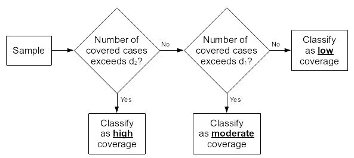

```{r, include = FALSE}
knitr::opts_chunk$set(
  collapse = TRUE,
  comment = "#>"
)
```

```{r setup, echo = FALSE}
library(sleacr)
```

The SLEAC method classifies program coverage for a service delivery unit such as a health district. A SLEAC survey does not provide an estimate of overall coverage with a confidence interval for a single service delivery unit. Instead, a SLEAC survey identifies the category of coverage (e.g. low, moderate, or high) that best describes the coverage of the service delivery unit being assessed. The advantage of this approach is that relatively small sample sizes (e.g. `n = 40`) are required in order to make accurate and reliable classifications.

SLEAC uses the lot quality assurance sampling (LQAS) classification technique.

* The SLEAC survey sample is designed to represent an entire service delivery unit such as a district.
      
* A target sample size for SLEAC surveys is decided in advance of data-collection. This  is usually about `n = 40` SAM cases.

* SLEAC surveys may classify coverage into three (or more) classes.

Analysis of data using the simplified LQAS classification technique involves examining the number of cases found in the survey sample (`n`) and the number of covered cases found:

* If the number of covered cases found exceeds a threshold value (`d`) then coverage is classified as being satisfactory.
      
* If the number of covered cases found does not exceed this threshold value (`d`) then coverage is classified as being unsatisfactory.

The threshold value (`d`) depends on the number of cases found (`n`) and the standard (`p`) against which coverage is being evaluated. A specific combination of `n` and `d` is called a sampling plan.

The following rule-of-thumb formula may be used to calculate a suitable threshold value (`d`) for any coverage proportion (`p`) and any sample size (`n`):

$$d ~ = ~ \left \lfloor n ~ \times ~ \frac{p}{100} \right \rfloor$$

For example, with a sample size (`n`) of 40 and a coverage proportion (`p`) of 70% an appropriate value for `d` would be:

$$d ~ = ~ \left \lfloor n ~ \times ~ \frac{p}{100} \right \rfloor ~ = ~ \left \lfloor 40 ~ \times ~ \frac{70}{100} \right \rfloor ~ = ~ \left \lfloor 40 ~ \times ~ 0.7 \right \rfloor ~ = ~ 28$$

It is unlikely that a SLEAC survey will return the target sample size (`n`) exactly. If a survey does not return the target sample size (`n`) exactly then the classification threshold value (`d`) should be recalculated using the achieved sample size. For example, if the target sample size is 40 but the achieved sample size is 43 and given a classification threshold of 70%, the appropriate classification threshold can be recalculated as follows:

$$d ~ = ~ \left \lfloor 43 ~ \times ~ \frac{70}{100} \right \rfloor ~ = ~ 30$$

Coverage is classified as described above. For example, out of the 43 SAM cases found only 34 are in the programme, the number of covered cases can be compared to the the decision threshold `d` calculated earlier. Since `34 > 30`, then coverage can be classified as *satisfactory*.

The `lqas_classify_coverage()` function in `{sleacr}` can perform this classification as follows:

```{r class-coverage}
lqas_classify_coverage(n = 34, n_total = 43, threshold = 0.7)
```

## Extending the classification method to yield finer classifications

The simplified LQAS classification technique provides *binary* or *two-tier* classifications.

The method may be extended to provide more granular classifications.

Three classes are sufficient for most SLEAC applications. A three-tier classification method is particularly useful for identifying very high coverage service delivery units and very low coverage service delivery units for inclusion in subsequent investigations.

Three-tier classifications require two sampling plans/decision rules. These are created using the *rule-of-thumb* formula presented earlier.

For three-tier classifications there are two coverage proportions:

`p1`:	The upper limit of the *low coverage* tier or class

`p2`:	The lower limit of the *high coverage* tier or class

The *moderate coverage* class runs from `p1` to `p2`.

Two classification thresholds (`d1` and `d2`) are used and are calculated as:

$$d_1 ~ = ~ \left \lfloor n ~ \times ~ \frac{p_1}{100} \right \rfloor$$

$$d_2 ~ = ~ \left \lfloor n ~ \times ~ \frac{p_2}{100} \right \rfloor$$

Classifications are made using the algorithm below.

```{r two-tier-algo, echo = FALSE, out.width = "85%", fig.align = "center", fig.alt = "Two-tier classification algorithm used in SLEAC"}

```

This three-class classification works well with small sample sizes (e.g. `n = 40`) provided that the difference between `p1` and `p2` is greater than or equal to 25 percentage points.

Here is an example of the calculations required for a sample size of 40 and classification thresholds of 30% and 70%:

$$d_1 ~ = ~ \left \lfloor n ~ \times ~ \frac{p_1}{100} \right \rfloor ~ = ~ \left \lfloor 40 ~ \times ~ \frac{30}{100} \right \rfloor ~ = ~ 12$$

$$d_2 ~ = ~ \left \lfloor n ~ \times ~ \frac{p_2}{100} \right \rfloor ~ = ~ \left \lfloor 40 ~ \times ~ \frac{70}{100} \right \rfloor ~ = ~ 28$$

Based on these decision rules, the following classifications are made:

+-------------------+-----------------------------------------+
| **Number of**     | **Classification**                      |
| **covered cases** |                                         |
+-------------------+-----------------------------------------+
| 1 to 12           | Low (< 30%) coverage                    |
+-------------------+-----------------------------------------+
| 13 to 28          | Moderate (between 30% and 70%) coverage |
+-------------------+-----------------------------------------+
| 29 to 40          | High (>= 70%) coverage                  |
+-------------------+-----------------------------------------+

If a survey does not return the target sample size (`n`) exactly then the classification thresholds (`d1` and `d2`) should be calculated using the achieved sample size and classifications made using the algorithm illustrated above. For example, a survey classifying coverage in individual clinic catchment areas using a target sample size of forty (40) cases for each catchment area and the class boundaries `p1 = 30%` and `p2 = 70%` returned the following data:

```{r two-tier-example, echo = FALSE}
data.frame(
  clinic = c(
    "Chawama", "Matero", "Makeni", "Chipata", "Ngombe", "Kalingalinga",
    "Mtendere", "Kanyama", "All"
  ),
  samp_size = c(38, 32, 43, 35, 42, 37, 39, 42, 308),
  d1 = c(11, 9, 12, 10, 12, 11, 11, 12, 92),
  d2 = c(26, 22, 30, 24, 29, 25, 27, 29, 215),
  in_cases = c(29, 18, 36, 15, 14, 10, 5, 23, 150),
  classification = c(
    "High", "Moderate", "High", "Moderate", "Moderate", "Low", "Low", 
    "Moderate", "Moderate"
  )
) |>
  knitr::kable(
    col.names = c(
      "Clinic catchment area", "Sample size", "d1", "d2", 
      "Number of covered cases", "Classification"
    )
  )
```

In this example the target sample size was applied to each of the clinic catchment areas separately. This allows coverage classifications to be made for individual clinic catchment areas. This approach enables the identification of low coverage and high coverage service delivery units (clinics in this example) for subsequent investigations.

The `lqas_classify_coverage()` function in `{sleacr}` can perform this classification as well. This can be done as follows:

```{r two-tier-coverage, eval = FALSE}
samp_size <- c(38, 32, 43, 35, 42, 37, 39, 42, 308)
in_cases <- c(29, 18, 36, 15, 14, 10, 5, 23, 150)

lqas_classify_coverage(
  n = in_cases, n_total = samp_size, threshold = c(0.3, 0.7)
)
```

which produces the following outputs:

```{r two-tier-coverage-show, echo = FALSE}
samp_size <- c(38, 32, 43, 35, 42, 37, 39, 42, 308)
in_cases <- c(29, 18, 36, 15, 14, 10, 5, 23, 150)

lqas_classify_coverage(
  n = in_cases, n_total = samp_size, threshold = c(0.3, 0.7)
)
```