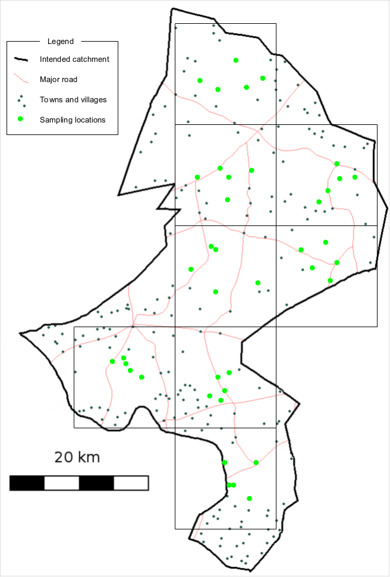
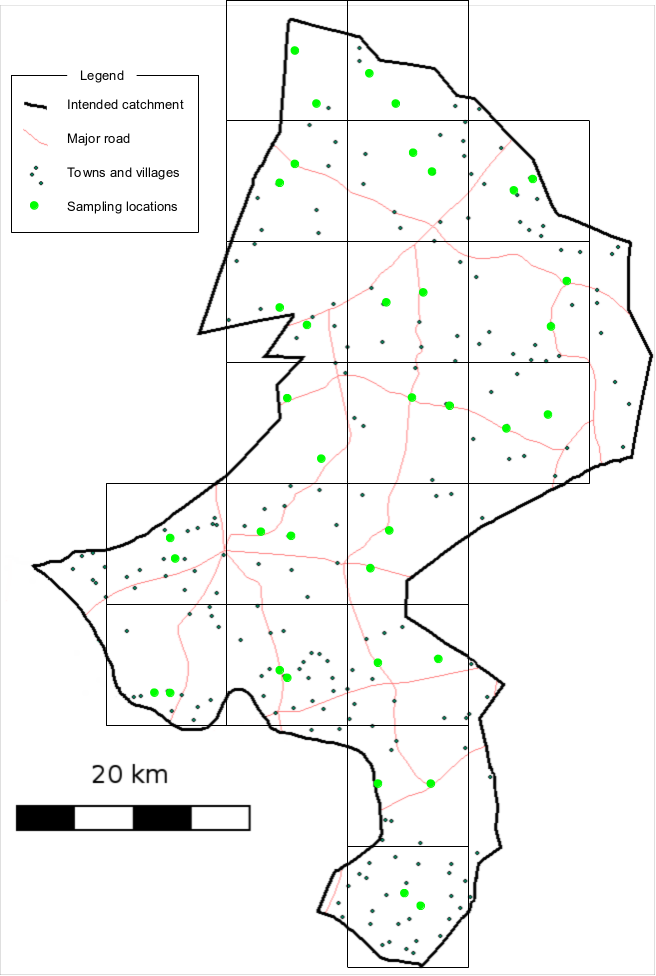
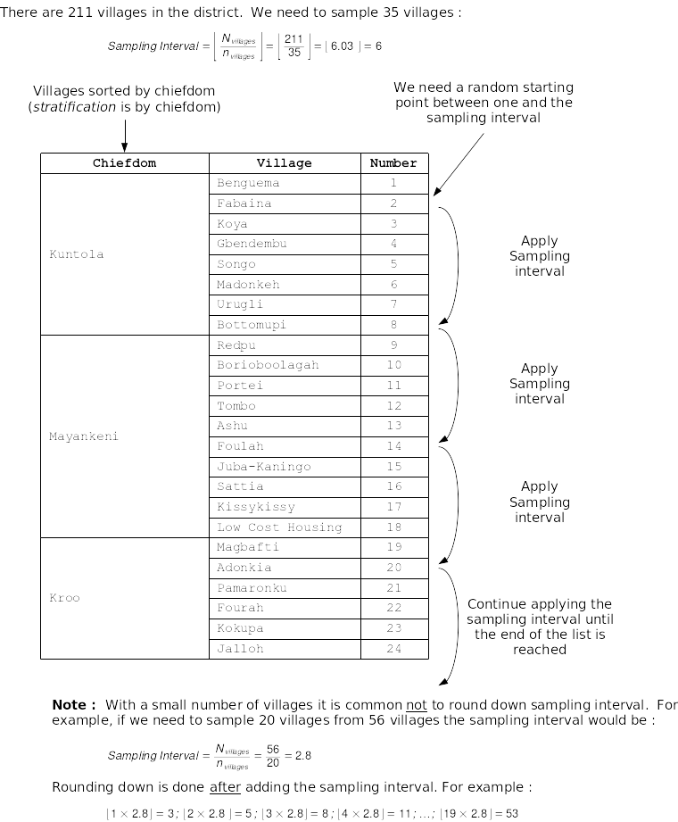

```{r, include = FALSE}
knitr::opts_chunk$set(
  collapse = TRUE,
  comment = "#>"
)
```

```{r setup, echo = FALSE}
library(sleacr)
```

The SLEAC sample design uses a two-stage cluster sample survey.

## First stage sampling method

This is the sampling method that is used to select the villages to be sampled. A centric systematic area sampling (CSAS)[^1] method or quadrat method could be used to select villages to be sampled for SLEAC surveys. The villages to be sampled may be selected by their proximity to the centre of each quadrat. The number/size of quadrats should be selected so as to spread the sample of villages over the entire program area. Many small quadrats are better than few large quadrats. For example, the sample illustrated im **Figure 1B** (nineteen quadrats) spreads the sample more evenly and over more of the program catchment area than the sample illustrated in **Figure 1A** (eight quadrats). You should use as many quadrats as is feasible with the time and resources available for the survey. 

```{r quadrat-method, echo = FALSE, out.width = "50%", fig.hold = TRUE, fig.alt = "Figure A is a map with 8 quadrats. Figure B is a map with 18 quadrats."}


```

**Figure 1: A.** Sampling plan with 8 quadrats **B.** Sampling plan with 18 quadrats

The CSAS/quadrat sampling method is appropriate for estimating coverage over a wide area such as a health district. Another useful approach is to stratify by clinic catchment area with a fixed number of villages selected systematically from a complete list of villages within each clinic catchment area (**Figure 2**) or within the boundaries of (e.g.) administrative areas for which lists of village or localities are available. 

```{r list-method, echo = FALSE, fig.align = "center", out.width = "85%", fig.alt = "Figure showing how list-based method for stage 1 sampling is conducted"}

```

**Figure 2:** Selection of villages to be sampled using spatially stratified sampling

This first stage sampling method should be a spatial sampling method that yields a reasonably even spatial sample from the survey area. Cluster sampling using population proportional sampling (PPS), such as that used for SMART surveys, is not appropriate. The stratified approach outlined above and illustrated in **Figure 2** also provides a reasonably even spatial sample using village lists and does not require the use of maps. It is important to note that sampling should not stop when the survey has reached its required sample size. Sampling only stops after you have sampled all of the the selected villages

The list-based method for stage 1 sampling is implemented in the `{sleacr}` package through the `get_sampling_list()` function. Using the same list of villages/communities described above and given a target number of villages/communities to sample, a sampling list can be created. Using the `village_list` dataset and for a target of 40 sampling clusters, a sampling list can be drawn as follows:

```{r list-based-sample, eval = FALSE}
get_sampling_list(village_list, 40)
```

which produces the following sampling list:

```{r list-based-sample-show, echo = FALSE}
get_sampling_list(village_list, 40) |>
  knitr::kable()
```

## Second stage within-community sampling method

This will usually be an active and adaptive case-finding method or a house-to-house census sampling method. These method find all, or nearly all, current and recovering SAM cases in a sampled village. Sampling should be exhaustive. This means that you only stop sampling when you are sure that you have found all cases in the community. Sampling should not stop when you have met a quota or the wider survey has reached its required sample size.

This is a two-stage sample because a sample of villages in the survey area is taken first (stage one) and then a “census” sample of current and recovering SAM cases is taken from each and every of the selected villages (stage two).

## SLEAC survey sample size

SLEAC uses a target sample size (`n`) which, together with prevalence and population estimates, is used to decide the number of villages ($n_{villages}$) that should be sampled in order to achieve the target sample size.

A target sample size (`n`) of forty (40) cases from each service delivery unit in which coverage is to be classified is usually large enough for most SLEAC applications.

In some settings it may be difficult or even impossible to find forty (40) cases. This will be the case if service delivery units are small and/or the prevalence of SAM is low. In these situations it is possible to use a smaller target sample size without increasing error. **Table 1** below shows target sample sizes that may be used when the total number of cases in a service delivery unit is likely to be small. 

**Table 1:** Target sample sizes for 50% and 70% coverage standards for use when surveying small service delivery units and/or the prevalence of SAM is low

+-----------------------------+------------------+-----------------------------+
| **Total number of**         | **50% standard** | **70% standard or 30%/70%** |
| **cases in the**            |                  | **class thresholds**        |
| **service delivery unit**   |                  |                             | 
| [^2]                        |                  |                             |
+-----------------------------+------------------+-----------------------------+
| 500                         | 37               | 33                          |
+-----------------------------+------------------+-----------------------------+
| 250                         | 35               | 32                          |
+-----------------------------+------------------+-----------------------------+
| 125                         | 31               | 29                          |
+-----------------------------+------------------+-----------------------------+
| 100                         | 29               | 26                          |
+-----------------------------+------------------+-----------------------------+
| 80                          | 27               | 26                          |
+-----------------------------+------------------+-----------------------------+
| 60                          | 25               | 25                          |
+-----------------------------+------------------+-----------------------------+
| 50                          | 23               | 22                          |
+-----------------------------+------------------+-----------------------------+
| 40                          | 21               | 19                          |
+-----------------------------+------------------+-----------------------------+
| 30                          | 17               | 18                          |
+-----------------------------+------------------+-----------------------------+
| 20                          | 15               | 15                          |
+-----------------------------+------------------+-----------------------------+

If, for example, the total number of cases in a service delivery unit is estimated to be about sixty (60) cases then a target sample size of twenty-five (25) cases may be used.

This sample size estimation can be performed using the `{sleacr}` package using the `get_sample_n()` function.

```{r samp-size, eval = FALSE}
get_sample_n(N = 60, dLower = 0.5, dUpper = 0.7)
```

which gives the following:

```{r samp-size-show, echo = FALSE}
get_sample_n(N = 60, dLower = 0.5, dUpper = 0.7)
```

The target sample size (`n`) together with estimates of the prevalence of severe acute undernutrition in the survey area and population data is used to calculate the number of villages ($n_{villages}$) that will need to be sampled in order to achieve the target sample size:

$$ n_{villages} ~ \times ~ \Biggl\lceil \frac{n}{\text{average village population}_{\text{all ages}} ~ \times ~ \frac{\text{Percentage of population}_{\text{all ages}}}{100} ~ \times ~ \frac{SAM prevalence}{100}} \Biggr\rceil $$

This calculation can be performed using the `get_n_clusters()` function in `{sleacr}`. If the target sample size is 40 and the average population size per village/cluster is 600:

```{r get-clusters}
get_n_clusters(n = 40, n_cluster = 600, u5 = 0.17, p = 0.02)
```

### Footnotes

[^1]: Milne, A. The centric systematic area-sample treated as a random sample. Biometrics 15, 270–297 (1959).
  
[^2]: This is an estimate of the number of SAM cases in a service delivery unit at the time of the survey: $\lfloor {Population_{\text{all ages}} \times \frac{\text{Percentage of population}_{\text{6-59 months}}}{100} \times \frac{\text{Prevalence SAM}}{100}} \rfloor$